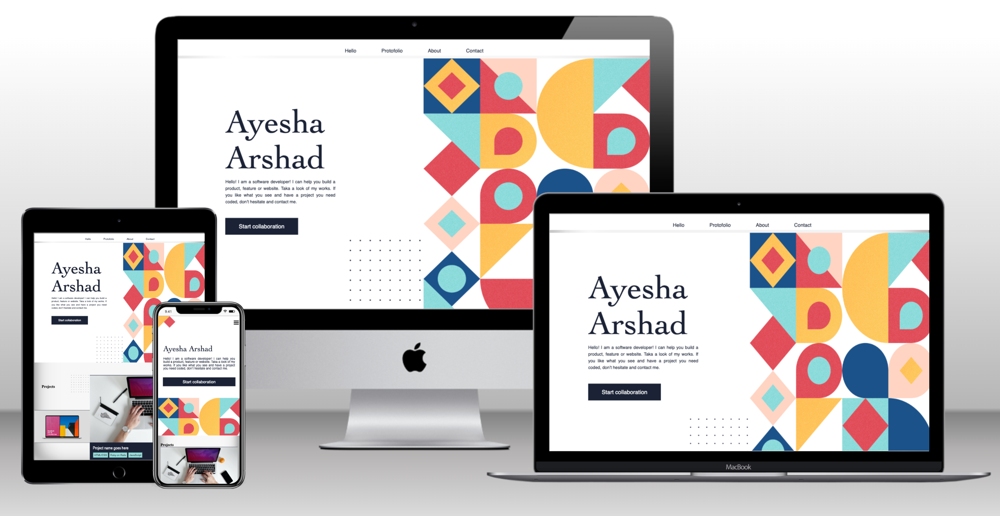

# portfolio
> This a portfolio website that inlists all my experiences and education

## Built With

- HTML, CSS
- Linters

## Live Demo

[Live Demo](https://shella12.github.io/Portfolio.github.io/)

## Authors

👤 **Author1**

- GitHub: [@shella12](https://github.com/githubhandle)
- Twitter: [@twitterhandle](https://twitter.com/twitterhandle)
- LinkedIn: [LinkedIn](https://linkedin.com/in/linkedinhandle)

## 🤝 Contributing

Contributions, issues, and feature requests are welcome!

Feel free to check the [issues page](../../issues/).

## Show your support

Give a ⭐️ if you like this project!

## Acknowledgments

- microverse documentation
- figma (for design template)

## 📝 License

This project is [MIT](./MIT.md) licensed.
